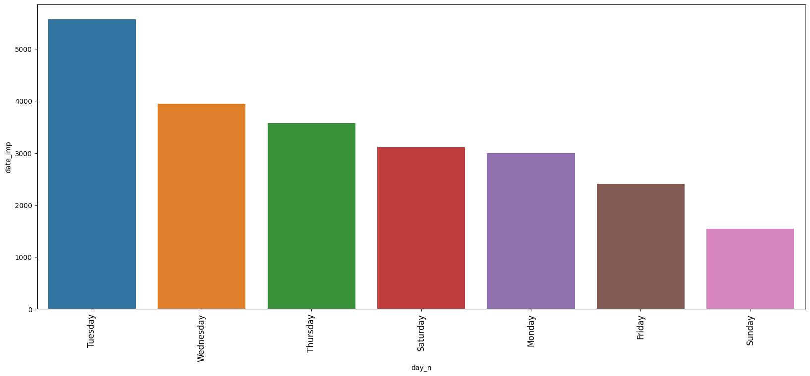
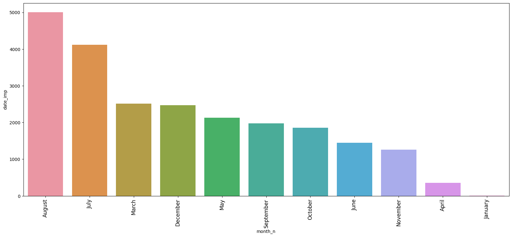
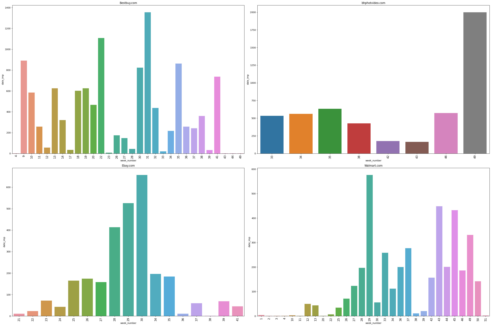

# Elasticidade de Preço - E-Commerces (Best Buy)

Foto de <a href="https://unsplash.com/pt-br/@belart84?utm_content=creditCopyText&utm_medium=referral&utm_source=unsplash">Artem Beliaikin</a> na <a href="https://unsplash.com/pt-br/fotografias/kTd2PvtqE_o?utm_content=creditCopyText&utm_medium=referral&utm_source=unsplash">Unsplash</a>
  

## Conhecendo os negócios
O e-commerce eletrônico, ou comércio online, são transações comerciais que são efetuadas na internet, como a venda de produtos. Termo também usado para loja virtual ou site de compras.

Best Buy, Walmart, Amazon e eBay estão os maiores ecommerces dos Estados Unidos. Vendendo grandes quantidades de items, de diversos setores, a precificação e descontos nos produtos são fatores determinantes para se manter no mercado.

## Questão de negócio
Para entender mais a relação dos produtos da Best Buy com seus concorrentes, os Gerentes de Custos e Orçamentos, Vendas e Marketing desejam analisar os dados reunidos por pesquisa com empresas concorrentes e entender como é a relação dos clientes com os preços de um setor de seus produtos.

O produto de dados será uma análise dos produtos das empresas e um dashboard aplicando elasticidade de preço com os produtos do seguimento Speaker/Portable/Bluetooth.

Além de responder as seguintes questões:
* Qual o merchant (e-commerce) que mais vendeu?
* Qual a categoria mais vendida?
* Quais a marca mais vendida?
* Quais os dias que mais vendem?
* Quais os meses que mais vendem?
* Quais as semanas que mais vendem?

## Entendendo os dados
Os dados obtidos no benchmarking contém as seguintes informações:
|Atributo|Definição|
|--------|---------|
|date_imp| Data|
|category_name| Categoria que o produto se enquadra|
|name| Nome do produto|
|price| Preço do produto|
|disc_price| Preço do produto com desconto|
|merchant| e-commerce onde o produto foi ofertado|
|disc_percentage| Porcentagem do desconto aplicado|
|is_sale| Se o produto está em promoção|
|imp_count|Contagem de produtos vendidos|
|brand|Marca do produto|]
|p_description|Descrição das categorias do produto|
|manufacturer|Fabricante do produto|

# Premissas de negócio
* Para análise das vendas entre empresas foram desconsiderados dados da Amazon, kmart e barcodable pela quantidade de dados
* Para estudo da elasticidade de preços foram considerados apenas os produtos da Best Buy da categoria "Speaker/Portable/Bluetooth"
* No estudo da elasticidade são foram considerados outros fatores, como tempo, contexto atual, concorrência, produtos substitutos e complementares, segmentação de clientes, políticas governamentais

# Planejamento
O planejamento da solução foi dividido em três etapas:
### _Entendendo o problema de negócio_
Entender a necessidade do time de vendas e responder as questões sobre as empresas do ramo.

### _Coleta de dados_
Coleta de dados de arquivo de pesquisa.

### _Limpeza dos dados_
Colunas renomeadas, limpeza dos dados, transformação dos dados para aplicação em modelos de regressão para análise de elasticidade.

### _Análise Exploratória de Dados (EDA)_
Exploração dos dados para adquirir conhecimento de negócio, analisar vendas por produtos e lojas.

### _Machine Learning_
Aplicação de Regressão Linear nos dados dos produtos da Best Buy para análise de elasticidade de preço, considerando apenas os produtos que apresentaram modelos com nível de significância estatistica menor que 5%.

### _Dashboard__
* Performance de negócio dos produtos considerando acréscimos e descontos dos produtos
* Relatório com dados de elasticidade e estatísticas dos produtos
* Tabela com elasticidade cruzada entre os produtos da categoria analisada

## Ferramentas
* Python 3.10.7
* Pandas, Numpy, Seaborn, Matplotlib, Statsmodels
* Git
* Técnicas de Regressão Linear para cálculo da elasticidade
* Streamlit

# Resultado de negócio - Insights
## Quais os dias que mais vendem?
No geral, o dia da semana que apresenta maiores vendas é Terça-feira seguido por Quarta-feira.

## Quais os meses que mais vendem?
No geral os meses com maiores vendas foram Agosto seguido de Julho.

## Quais semanas mais vendem por loja?
Considerando a Best Buy, a semana com maior quantidade de vendas foi a 31 (final de Julho e início de Agosto), seguida da semana 22 (final de Maio e início de Junho).

# Deploy
Para deploy foi utilizada a biblioteca Streamlit para desenvolvimento de dashboard online, com aplicação da elasticidade de preço dos produtos analisados, estatísticas individuais e elasticidade cruzada com outros produtos da categoria.
Clique no botão abaixo e interaja alterando o valor de desconto ou acréscimo:

# Conclusão
O objetivo de analisar as informações para responder as perguntas de negócio foi atendido, assim como a entrega do dashboard para melhor entendimento da relação de produtos e dados, onde é possível visualizar o retorno esperado em diferentes cenários.

# Próximos passos
* Obter mais dados dos produtos analisados
* Analisar outros fatores que influenciam na venda dos produtos
* Analisar a relação entre produtos de outras marcas (elasticidade cruzada)